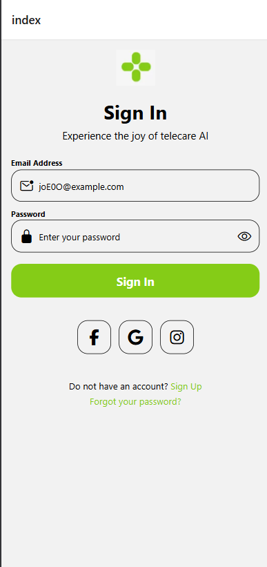

# Sign In Page

A React Native sign-in page built with Expo. The screen includes email and password inputs, password visibility toggle, social sign-in buttons, and account recovery links.

## Screenshot



## Features

- Email address input with icon
- Password input with show/hide toggle
- Highlighted input border on focus
- Sign in button
- Social sign-in buttons for Facebook, Google, and Instagram
- Sign up and forgot password links

## Tech Stack

- React Native
- Expo
- Expo Router
- TypeScript

## Getting Started

Install dependencies:

```bash
npm install
```

Start the development server:

```bash
npx expor start
```

You can also run the app on a specific platform:

```bash
npm run android
npm run ios
npm run web
```

## Project Structure

```text
src/app/index.tsx    Main sign-in page screen
assets/              Images and app assets
```

## Linting

Run the linter:

```bash
npm run lint
```
